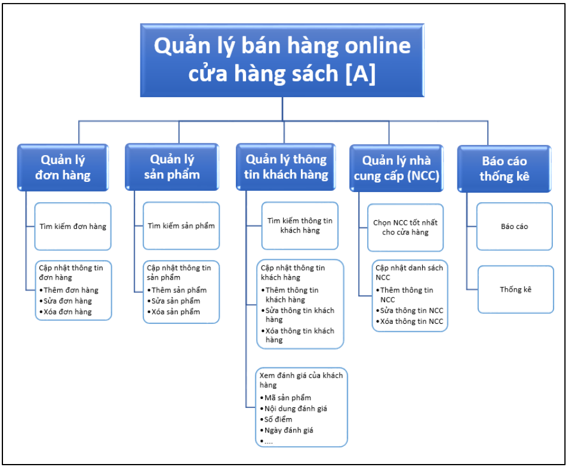
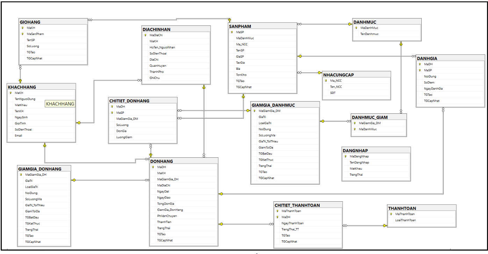

# 📚 Hệ Thống Quản Lý Cửa Hàng Sách Online

## 📝 Giới thiệu
Hệ thống quản lý bán sách trực tuyến hỗ trợ các chức năng:
- Quản lý sản phẩm: sách, danh mục, nhà cung cấp
- Quản lý đơn hàng, khách hàng
- Quản lý giỏ hàng, thanh toán, mã giảm giá
- Đánh giá sản phẩm và quản lý tài khoản

[LIÊN KẾT BÁO CÁO CHI TIẾT](https://online.fliphtml5.com/tpfov/xnsg/)

Hệ thống sử dụng **SQL Server** để lưu trữ và quản lý dữ liệu.

---
## 📂 Database Schema

| Bảng | Mô tả |
|------|-------|
| `SANPHAM` | Quản lý thông tin sản phẩm (mã, danh mục, NCC, giá, tồn kho, ngày tạo/cập nhật) |
| `NHACUNGCAP` | Quản lý thông tin nhà cung cấp (mã, tên, số điện thoại) |
| `DANHMUC` | Quản lý danh mục sản phẩm (mã, tên danh mục) |
| `DONHANG` | Quản lý đơn hàng (mã đơn hàng, khách hàng, giảm giá, địa chỉ, ngày đặt, ngày giao, trạng thái, tổng tiền) |
| `DIACHINHAN` | Quản lý địa chỉ nhận hàng của khách (mã địa chỉ, khách hàng, thông tin liên hệ, địa chỉ) |
| `CHITIET_DONHANG` | Lưu chi tiết đơn hàng (mã đơn hàng, sản phẩm, số lượng, đơn giá, giảm giá) |
| `CHITIET_THANHTOAN` | Chi tiết thanh toán của đơn hàng (mã thanh toán, đơn hàng, ngày thanh toán, trạng thái) |
| `KHACHHANG` | Thông tin khách hàng (mã khách hàng, tên đăng nhập, mật khẩu, thông tin cá nhân) |
| `DANHGIA` | Quản lý đánh giá sản phẩm từ khách hàng (mã đơn hàng, sản phẩm, nội dung, điểm số, ngày đánh giá) |
| `GIAMGIA_DANHMUC` | Quản lý giảm giá áp dụng cho danh mục (mã giảm giá, giá trị, số lượng, thời gian hiệu lực) |
| `GIAMGIA_DONHANG` | Quản lý mã giảm giá cho đơn hàng (mã giảm giá, giá trị, số lượng, thời gian hiệu lực) |
| `GIOHANG` | Quản lý giỏ hàng của khách hàng (mã khách hàng, sản phẩm, số lượng, thời gian tạo/cập nhật) |
| `DANHMUC_GIAM` | Liên kết danh mục với giảm giá danh mục (mã giảm giá, mã danh mục) |
| `THANHTOAN` | Quản lý phương thức thanh toán (mã, loại thanh toán) |
| `DANGNHAP` | Quản lý tài khoản đăng nhập của khách hàng (mã đăng nhập, tên đăng nhập, mật khẩu, trạng thái) |

## Ràng buộc & Khóa ngoại
- **Khóa chính**: Mỗi bảng có khóa chính để đảm bảo tính duy nhất của dữ liệu.
- **Khóa ngoại**: Các bảng có liên kết với nhau qua các khóa ngoại để duy trì tính toàn vẹn dữ liệu.
- **Ràng buộc**: Các bảng có ràng buộc về giá trị mặc định, kiểm tra dữ liệu, và quy tắc xóa/cập nhật.
- Các bảng được thiết kế để hỗ trợ tính năng CRUD đầy đủ.
- Mã hóa dữ liệu quan trọng như mật khẩu khách hàng bằng phương pháp bảo mật phù hợp.
- Sử dụng chỉ mục (`INDEX`) để tối ưu hóa truy vấn đối với các bảng có lượng dữ liệu lớn.

## ⚙️ Cài đặt
### 1️⃣ Yêu cầu hệ thống
- **SQL Server** (Khuyến nghị từ phiên bản 2016 trở lên)
- **SQL Server Management Studio (SSMS)** (Tùy chọn, để quản lý trực quan)

### 2️⃣ Cách sử dụng
1. Cài đặt SQL Server
2. Kết nối SQL Server bằng SSMS
3. Chạy script tạo database

---
## 📊 Mô hình dữ liệu
### Conceptual Modeling

### Relational Modeling

### ERD Diagram
Following link is the ERD diagram for the database schema: 
[ERD Diagram](https://app.diagrams.net/?src=about#G1HVLxEQdtzOsbltYHHNt2GqZ_9BibAl0c#%7B%22pageId%22%3A%22N8Y_9LVRAVbi6H1STJq4%22%7D)

## TẠO CSDL

`./Database design/create_database.sql`

## Dữ liệu mẫu
`./Database design/datasample.sql`

## Thiết kế chức năng (PROCEDURE)
`./Database design/procedure.sql`

- --Sản phẩm được mua bởi khách hàng nào--
- --Sản phẩm được mua bởi ai thuộc đơn hàng nào và loại thanh toán là gì--
- --Sản phẩm được đánh giá bởi khách hàng nào với số điểm và nội dung là gì--- 
- --Sản phẩm thuộc danh mục nào và danh mục đó có được giảm giá không-- 
- --Sản phẩm được mua bởi ai với giá bao nhiêu thuộc đơn hàng nào và đơn hàng đó có 
được giảm giá không và địa chỉ nhận của đơn hàng-- 
- --Sản phẩm được cung cấp bởi ai và nằm trong danh mục nào-- 
- --Khách hàng muốn biết sản phẩm mình mua được viết bởi tác giả nào và do ai là 
người cung cấp --
- --Sản phẩm thuộc đơn hàng nào với số lượng sản phầm là bao nhiêu với khách hàng là 
ai--
- --Khách hàng mua sản phẩm nào nhiều hơn, ít hơn để có thể ra chiến lược kinh doanh 
( sách nào nhập nhiều sách nào nhập ít )-- 
- --Dựa vào số lượng các sản phẩm bán được và độ tồn kho của sản phẩm để đưa ra 
chiến lược kinh doanh ( ngưng nhập sách bán chậm, đưa ra các mã giá cho sách bán 
chậm,...)--
- --Nhập tên người dùng để xem trạng thái thanh toán và trạng thái của đơn hàng--
- --Số lượng sản phẩm có trong giỏ hàng của khách hàng-- 
- --Tổng doanh thu sản phẩm--
- --Xếp hạng danh mục được yêu thích theo số lượng sản phẩm bán được --
- --Doanh thu của danh mục--
- --Xếp hạng doanh thu của danh mục--
- --Nhà cung cấp tiềm năng theo doanh thu số lượng sản phẩm--
- --Chức năng thêm một đơn hàng mới gồm chi tiết đơn hàng và chi tiết thanh toán, 
trong đó người dùng nhập vào mã khách hàng và các thông tin cần thiết--

## TRIGGER
`./Database design/trigger.sql`
- --Tạo trigger, cập nhật thời gian của update trong bảng giamgia_danhmuc
- --Tạo trigger, cập nhật thời gian của update trong bảng giamgia_donhang
- --Tạo trigger, kiểm tra tồn kho đối với bảng chi tiết đơn hàng
- - Tạo trigger, kiểm tra tồn kho  cho bảng GIOHANG
- -Tạo trigger, khi thay đổi dữ liệu cho bảng đánh giá, phải quy chiếu đến bảng đơn hàng, 
nếu trạng thái là đã giao thì mới được phép thay đổi dữ liệu
- --Trong bảng CHI TIET THANH TOÁN  và bảng đơn hàng,ngày đặt <= ngày thanh 
toán <= ngày giao 
- -- Tạo trigger, trạng thái đơn hàng chỉ được cập nhật  'đang giao' , 'đã giao', 'đã hủy', 
'xử lý hoàn', 'đang hoàn', 'đã hoàn', chỉ khi trạng thái trong bảng chi tiết thanh toán 'thành 
công'
- -- Tạo trigger, thống kê số lượng magiamgia_donhang trong bảng đơn hàng, số lượng 
mã tương ứng phải <= số lượng mã trong bảng giảm giá danh mục, trạng thái khác 0
-  -- Tạo trigger, thống kê số lượng magiamgia_danhmuc trong bảng chi tiết đơn hàng, số 
lượng mã tương ứng phải <= số lượng mã trong bảng giảm giá danh mục
- -- Tạo trigger, trong bảng đơn hàng, nếu đơn hàng không ở trạng thái ('đã giao', 'đã hủy', 
'xử lý hoàn', 'đang hoàn', 'đã hoàn') thì ngày giao phải là NULL
- -- Tạo trigger, kiểm tra giá trị đơn hàng đã đủ áp dụng mã giảm giá đơn hàng chưa 
- -- Tạo trigger,kiểm tra giá trị của giá trị đơn hàng đã đạt đơn hàng tối thiểu chưa
- --Tạo trigger, khi thay đổi dữ liệu trong bảng chi tiết đơn hàng, luonggiam có hai trường 
hợp : nếu magiamgia_dm có loaigiatri là GIATRI thi luogngiam = giatri mã giảm* số 
lượng.  Nếu  magiamgia_dm  có  loaigiatri  là  PHANTRAM  thì  luonggiam  = 
GiaSP*Soluong*Giatri mã giảm,  luonggiam= giamtoida nếu lượng giảm lớn hơn giảm 
tối đa trong bảng giảm giá danh mục lượng giảm = giaSP*soluong nếu giá trị voucher >= giaSP*soluong
- -- update luonggiam theo loại giá trị mã giảm giá
- -- Cập nhật luonggiam= giamtoida nếu lượng giảm lớn hơn giảm tối đa trong bảng giảm 
giá danh mục 
- --Cập nhật lượng giảm = giaSP*soluong nếu giá trị voucher >= giaSP*soluong

## 📌 Ghi chú
- Dữ liệu được chuẩn hóa nhằm tối ưu hiệu suất.
- Nếu có bất kỳ vấn đề gì, vui lòng liên hệ đội phát triển.

---
*© 2023 - Hệ thống quản lý bán hàng*

